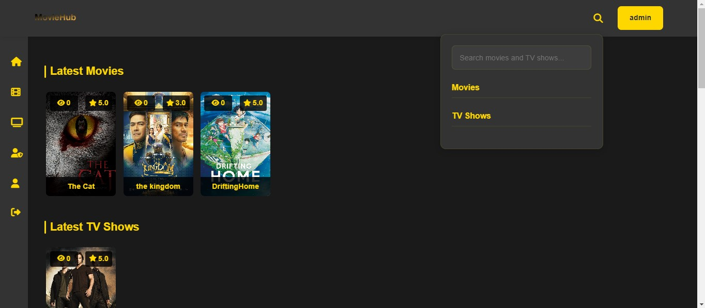
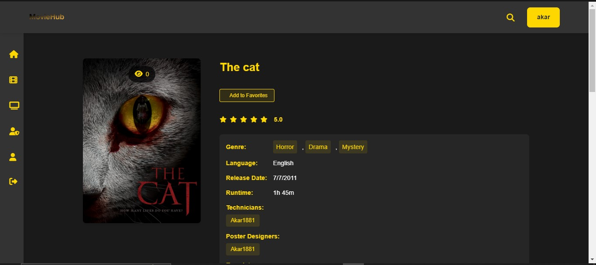
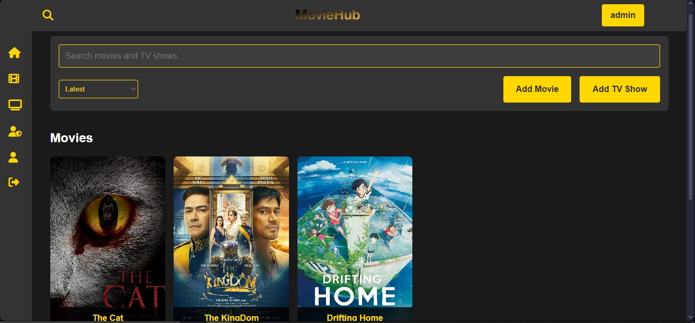

# MovieHUB 🎬

MovieHUB is a powerful and feature-rich movie and TV show streaming platform built with Node.js and Express. It provides a seamless experience for users to watch their favorite movies and TV shows online.



## Features ✨

- 🎥 Stream movies and TV shows
- 📺 Multiple streaming servers for each content
- 🌟 User ratings and reviews system
- ❤️ Favorite content management
- 🔍 Advanced search functionality
- 👤 User authentication and profiles
- 🎨 Beautiful and responsive UI
- 🛡️ Admin panel for content management
- 📱 Mobile-friendly design

## Tech Stack 🛠️

- **Backend**: Node.js, Express
- **Database**: SQLite3
- **Template Engine**: EJS
- **Authentication**: Express Session
- **File Upload**: Multer
- **Password Hashing**: bcryptjs
- **Styling**: Custom CSS with responsive design

## Installation 🚀

1. Clone the repository:
   ```bash
   git clone https://https://github.com/Akar1881/MovieHUB.git
   cd moviehub
   ```

2. Install dependencies:
   ```bash
   npm install
   ```

3. Create necessary directories:
   ```bash
   mkdir -p database public/uploads
   ```

4. Start the development server:
   ```bash
   npm run dev
   ```

5. Visit `http://localhost:3000` in your browser

## Environment Setup 🔧

The application uses a `config.json` file for configuration. Create it in the root directory:

```json
{
  "site": {
    "name": "MovieHub",
    "description": "Watch your favorite movies and TV shows",
    "logo": "/images/logo.png"
  },
  "theme": {
    "primary": "#FFD700",
    "background": "#1A1A1A",
    "text": "#FFFFFF",
    "secondary": "#333333"
  },
  "admin": {
    "email": "admin@example.com",
    "password": "admin123",
    "username": "admin"
  },
  "upload": {
    "poster": {
      "width": 1200,
      "height": 1809
    },
    "allowedTypes": ["image/jpeg", "image/png"]
  }
}
```

## Project Structure 📁

```
moviehub/
├── config.json
├── database/
├── src/
│   ├── database.js
│   ├── index.js
│   ├── public/
│   │   ├── css/
│   │   ├── images/
│   │   └── uploads/
│   ├── routes/
│   │   ├── admin.js
│   │   ├── api.js
│   │   ├── auth.js
│   │   ├── movies.js
│   │   ├── tvshows.js
│   │   └── users.js
│   └── views/
│       ├── admin/
│       ├── auth/
│       ├── movies/
│       ├── tvshows/
│       ├── users/
│       └── partials/
└── package.json
```

## Features in Detail 📝

### For Users 👥

1. **Browse Content**
   - View latest movies and TV shows
   - Search by title
   - Filter by genre, type, and rating
   - Sort by various criteria

2. **Watch Content**
   - Multiple streaming servers
   - Continue watching feature
   - Full-screen mode

3. **User Features**
   - Create an account
   - Add reviews and ratings
   - Save favorites
   - Manage profile

### For Admins 👑

1. **Content Management**
   - Add/edit/delete movies and TV shows
   - Manage streaming servers
   - Upload posters
   - Organize content by genre

2. **User Management**
   - View user list
   - Manage user roles
   - Remove inappropriate reviews

## Screenshots 📸

### Home Page


### Movie Details


### TV Show Page


### Admin Dashboard


## Contributing 🤝

We welcome contributions! Here's how you can help:

1. Fork the repository
2. Create a new branch: `git checkout -b feature-name`
3. Make your changes
4. Commit your changes: `git commit -m 'Add some feature'`
5. Push to the branch: `git push origin feature-name`
6. Submit a pull request

Please make sure to:
- Follow the existing code style
- Add comments for new functions
- Update documentation if needed
- Test your changes thoroughly

## License 📄

This project is licensed under the MIT License - see the [LICENSE](LICENSE) file for details.

## Support 💬

If you have any questions or need help, please:
1. Check the [issues](https://github.com/Akar1881/MovieHUB/issues) page
2. Create a new issue if needed
3. Join our community discussions

## Acknowledgments 🙏

- Thanks to all contributors
- Special thanks to the open-source community
- Icon pack by FontAwesome